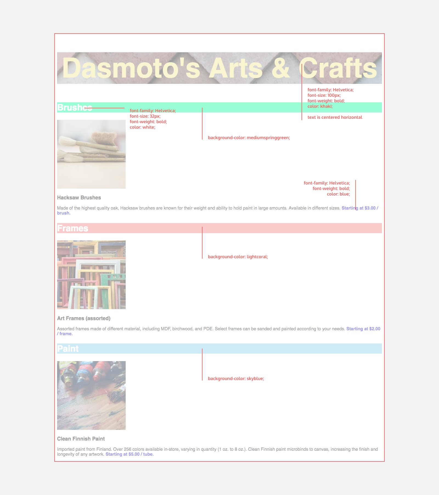
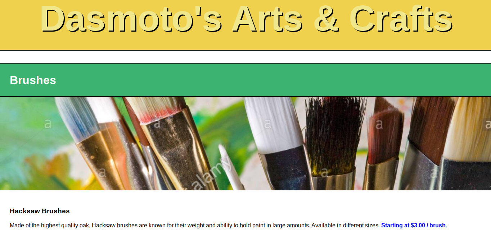

# Dasmoto's Arts & Crafts

In this project, you’ll build a simple website for a fictional arts and crafts store using the tools on your own computer. This project will provide you with less guidance than previous projects.

At a high-level, this project will require the following:

- A folder structure that makes sense for the project
- An HTML file
- A CSS file

The rest of the page’s styling (font sizes, colors, etc.) is outlined in the following design spec, which is a standard document you’d expect to receive as a freelance web developer:

## Completed First Draft

